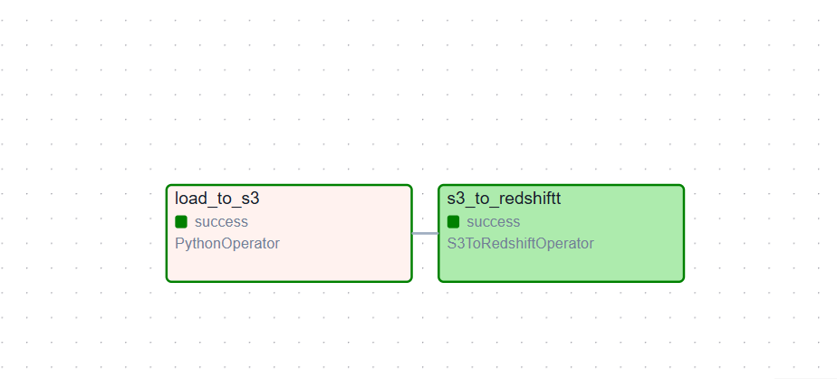

# Daily Sales Transaction Data Pipeline Project 

This project is a **data engineering pipeline** for generating and loading  transactional sales data into Amazon Redshift using AWS services and orchestration tools.

---

## Project Overview

**Goal:**  
To generate sales transaction data, upload it to Amazon S3, and load it into Amazon Redshift using the `COPY` command. The infrastructure is provisioned using **Terraform**, and the workflow is orchestrated using **Apache Airflow**.

---

## Architecture Overview

The pipeline consists of the following steps:

1. **Data Generation (Python)**  
   - Generates sales transactions using the `faker` library.
   - Saves the data in `.parquet` format.

2. **S3 Upload (Python / Airflow)**  
   - Uploads the generated data to an S3 bucket in a date-partitioned path.

3. **Data Warehouse Load**  
   - Uses Redshift's `COPY` command to ingest data directly from S3 into a Redshift table.

4. **Orchestration (Airflow)**  
   - DAGs schedule and control the end-to-end workflow, from data generation to loading.

**Airflow DAG Flow**

Below is a visual representation of the successful DAG execution in Airflow (Graph View), showing the orchestration of tasks from data generation to loading into Redshift.

5. **Provisioning (Terraform)**  
   - Manages the Redshift cluster, IAM roles, S3 bucket, and supporting infrastructure.

---

##  Tools Used

| Tool          | Purpose                                |
|---------------|----------------------------------------|
| **Python**    | Data generation & S3 upload            |
| **Airflow**   | Workflow orchestration                 |
| **Terraform** | Infrastructure as Code (IaC)           |
| **AWS S3**    | Cloud storage for raw data             |
| **AWS Redshift** | Cloud data warehouse                 |
| **awswrangler** | Efficient upload to S3 using parquet |
| **Faker**     | Generating sales data              |

---

